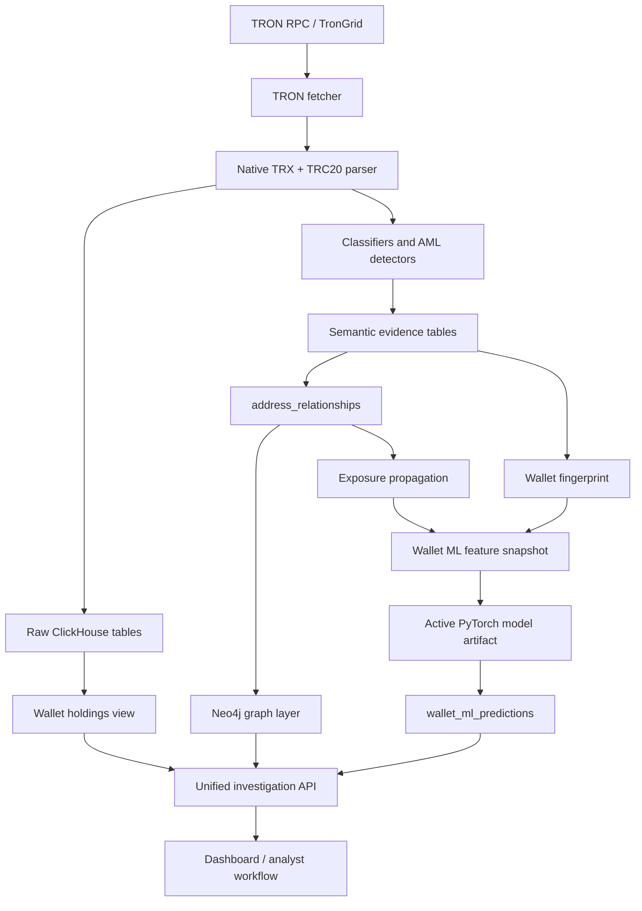

# TRON AML Implementation Specification

This document is the master specification for the current TRON AML implementation.
It describes how the project ingests TRON data, stores AML evidence in
ClickHouse, builds graph and wallet-level investigation outputs, and connects the
AI-native wallet risk model.

Use this file as the implementation template for future networks such as
Ethereum, BSC, Polygon, Solana, and other chains. The chain-specific parts should
change per network, but the canonical data contracts, investigation response, ML
feature lifecycle, and analyst workflow should remain consistent.

## 1. Current Objective

Given one wallet address, the TRON implementation must return:

- Fund flow graph visualization.
- Wallet holdings.
- Wallet behavioral fingerprint.
- Exposure to risky seeds and entities.
- AI/ML laundering probability, produced from stored deterministic evidence.
- Data quality warnings that tell the analyst whether the output is complete
  enough to trust.

The intended product shape is Chainalysis-style wallet investigation:

1. Index on-chain activity.
2. Normalize raw chain events into canonical tables.
3. Detect semantic activity such as transfers, swaps, bridges, mint/burn events,
   liquidity operations, and exchange interactions.
4. Persist graph relationships and behavioral evidence.
5. Build wallet-level features from ClickHouse.
6. Run a trained AI model over those features.
7. Return explainable wallet investigation output through the API and UI.

## 2. Source Code Map

Main runtime files:

- `app/src/bin/tron_init_schema.rs`: initializes TRON ClickHouse schema.
- `app/src/bin/tron_graph_api.rs`: runs the Axum API and dashboard.
- `app/src/bin/tron_export_wallet_graph.rs`: exports one wallet graph into Neo4j.
- `app/src/router.rs`: defines TRON API routes.
- `app/src/handlers/dashboard.rs`: serves `app/web/index.html`.
- `app/src/handlers/tron_common.rs`: shared address normalization, ClickHouse,
  and Neo4j client helpers.
- `app/src/handlers/tron_graph.rs`: wallet graph endpoint.
- `app/src/handlers/tron_wallet_holdings.rs`: holdings endpoint.
- `app/src/handlers/tron_wallet_fingerprint.rs`: fingerprint endpoint.
- `app/src/handlers/tron_wallet_ai_risk.rs`: AI risk endpoint.
- `app/src/handlers/tron_wallet_investigation.rs`: unified investigation endpoint.

Main TRON service modules:

- `app/src/services/tron/fetcher.rs`: block and transaction ingestion pipeline.
- `app/src/services/loader.rs`: ClickHouse and TronGrid loader setup.
- `app/src/services/tron/batcher.rs`: batched inserts into ClickHouse.
- `app/src/services/tron/aml/*`: AML event detectors and shared event types.
- `app/src/services/tron/tron_classifier/*`: protocol and contract classifier.
- `app/src/services/tron/transaction_type.rs`: semantic transaction classifier.
- `app/src/services/tron/risk_engine.rs`: transaction-level evidence scoring.
- `app/src/services/tron/relationship_builder.rs`: canonical graph edge builder.
- `app/src/services/tron/exchange/*`: exchange seed and heuristic attribution.
- `app/src/services/tron/exposure/*`: exposure propagation from seed addresses.
- `app/src/services/tron/wallet_exposure.rs`: wallet exposure summary loader.
- `app/src/services/tron/wallet_fingerprint.rs`: wallet behavior fingerprint.
- `app/src/services/tron/wallet_holdings.rs`: wallet holdings from derived balances.
- `app/src/services/tron/wallet_ai_risk.rs`: ML feature snapshot, model loading,
  inference, and prediction persistence.
- `app/src/services/tron/wallet_investigation.rs`: unified investigation assembly.
- `app/src/services/tron/neo4j/*`: Neo4j graph import and wallet graph response.

Schema and ML files:

- `app/sql/init_database_tron.sql`: active TRON AML warehouse schema.
- `app/sql/tron_migration_20260705_0005_wallet_ml_native.sql`: ML-native wallet
  risk tables.
- `app/src/db/init_tron.rs`: migration runner, checksum guard, cleanup guard, and
  holdings backfill logic.
- `ml/tron_wallet_risk/train.py`: PyTorch tabular model trainer.
- `ml/tron_wallet_risk/build_training_csv_from_api.py`: feature CSV builder from
  labeled wallet addresses.
- `ml/tron_wallet_risk/export_training_dataset.sql`: ClickHouse training export.
- `ml/tron_wallet_risk/README.md`: ML pipeline usage notes.

## 3. High-Level Architecture



The important architecture rule is separation of responsibilities:

- Rust and ClickHouse collect and persist verifiable evidence.
- Rule-like transaction semantics are stored as evidence features, not final
  wallet laundering probability.
- The wallet-level laundering probability is produced by the active ML model.
- The UI and API expose evidence, model output, and data quality together.

## 4. Runtime Configuration

Configuration is loaded in `app/src/config.rs`.

Core environment variables:

| Variable | Purpose | Default |
| --- | --- | --- |
| `APP_MODE` | Runtime chain mode. TRON is the default. | `tron` |
| `SYNC_MODE` | Backfill, live, or auto sync mode. | `auto` |
| `CLICKHOUSE_URL` | ClickHouse HTTP endpoint. | `http://localhost:8123` |
| `CLICKHOUSE_USER` | ClickHouse user. | `admin` |
| `CLICKHOUSE_PASSWORD` or `CLICKHOUSE_PASS` | ClickHouse password. | `mehran.admin` |
| `CLICKHOUSE_DB_TRON` | TRON database. | `tron_db` |
| `TRON_RPC_URL` or `TRON_RPC_HTTP` | TRON RPC endpoint. | `https://api.trongrid.io` |
| `TRON_API_KEY` or `TRONGRID_API_KEY` | Optional TronGrid API key. | none |
| `TRON_START_BLOCK` | Start block for ingestion. | `0` |
| `TOTAL_TRON_TXS` | Current ingestion limit knob. | `200` |
| `RPC_TIMEOUT_SECONDS` | RPC timeout. | `120` |
| `RPC_MAX_CONCURRENCY` | RPC concurrency. | `2` |
| `TX_WORKER_CONCURRENCY` | Transaction worker concurrency. | `2` |
| `NEO4J_URI` | Neo4j Bolt endpoint. | `localhost:7687` |
| `NEO4J_USERNAME` | Neo4j username. | `neo4j` |
| `NEO4J_PASSWORD` | Neo4j password. | empty |
| `TRON_GRAPH_API_ADDR` | API bind address. | `0.0.0.0:4200` |
| `TRON_ALLOW_DESTRUCTIVE_SCHEMA_CLEANUP` | Enables dropping obsolete tables. | `false` |

Operational commands:

```powershell
docker compose up -d clickhouse neo4j

cd D:\Sarbazi\dockerizd_eth_code\app
cargo run --bin tron_init_schema

$env:TRON_GRAPH_API_ADDR="127.0.0.1:4001"
cargo run --bin tron_graph_api
```

Dashboard:

```text
http://127.0.0.1:4001/
```

## 5. Schema and Migration Strategy

The active schema is created by `app/sql/init_database_tron.sql`.

The migration runner is `app/src/db/init_tron.rs`. It applies:

1. `20260701_0001_tron_active_schema`: idempotent bootstrap schema.
2. `20260705_0005_wallet_ml_native`: ML-native wallet risk tables.

Important migration behavior:

- `schema_migrations` records migration id, description, checksum, and timestamp.
- The bootstrap schema allows checksum drift because it is idempotent and can
  refresh active schema objects.
- Follow-up migrations are immutable. If a checksum changes, the initializer
  fails and a new migration must be created.
- Destructive cleanup is disabled unless
  `TRON_ALLOW_DESTRUCTIVE_SCHEMA_CLEANUP=true`.
- Obsolete or redundant objects are warned about when cleanup is disabled.
- Derived wallet balance objects can be rebuilt safely when destructive cleanup
  is explicitly enabled.
- If `wallet_asset_balance_deltas` is missing or empty, the initializer backfills
  it from existing native and token transfers.

Future chains should copy this pattern:

- One idempotent bootstrap schema for active objects.
- Immutable dated migrations for every later change.
- A `schema_migrations` ledger.
- Explicit env-gated cleanup for obsolete objects.
- Backfill routines only for derived data that can be reconstructed.

## 6. Canonical ClickHouse Data Model

### 6.1 Raw Chain Data

`transactions`

- One row per TRON transaction.
- Stores hash, block number, timestamp, sender, receiver, contract address,
  contract type, amount, fee/energy/net usage, status, and memo.
- Produced by the fetcher after parsing raw TRON transactions.
- Consumed by graph, holdings, fingerprint, and transaction classifiers.

`raw_logs`

- One row per receipt log.
- Stores transaction hash, block, log index, contract address, topics, data,
  removed flag, and timestamp.
- Used for TRC20 event reconstruction and future forensic inspection.

`token_transfers`

- One row per TRC20 Transfer event.
- Stores token address, sender, receiver, raw amount, mint/burn flags, and event
  signature.
- Used for holdings, graph edges, token behavior, and wallet fingerprinting.

`token_metadata`

- One row per token contract.
- Stores name, symbol, decimals, total supply, verification state, and update
  timestamp.
- Used to display holdings and interpret token transfers.

### 6.2 Canonical Graph Data

`address_relationships`

- The central graph edge table.
- Contains both raw value-transfer edges and semantic AML event edges.
- Key columns:
  - `relationship_id`
  - `from_address`
  - `to_address`
  - `token_address`
  - `tx_hash`
  - `block_number`
  - `timestamp`
  - `amount`
  - `transfer_type`
  - `protocol`
  - `event_type`
  - `risk_score`
  - `hop_count`

Relationship types are built in `relationship_builder.rs`:

- Native TRX transfer.
- TRC20 transfer.
- Swap.
- Bridge in/out.
- Liquidity add/remove.
- Mint.
- Burn.

This table is the main portable contract for future chains. Every network should
eventually normalize its value flow and semantic activity into an equivalent
relationship table.

### 6.3 Entity and Exchange Intelligence

`address_entity`

- Generic address-to-entity attribution table.
- Used by fingerprint and graph enrichment.

`exchange_entities`

- Exchange entity registry.

`exchange_addresses`

- Exchange wallet addresses with roles such as hot wallet, deposit wallet, or
  withdrawal wallet.

`exchange_deposit_addresses`

- Deposit-address attribution, usually detected by sweep behavior.

`exchange_clusters`

- Exchange cluster membership rows.

`exchange_flows`

- Transaction-level flows into or out of exchanges.
- Used by transaction semantics, graph enrichment, and wallet fingerprinting.

Exchange detection currently combines:

- Hardcoded seeds in `exchange/seeds.rs`.
- Stored exchange attribution.
- Heuristics in `exchange/detector.rs`, such as repeated sweep behavior into an
  exchange wallet or high fan-in/fan-out exchange-like activity.

### 6.4 Contract and Semantic Transaction Evidence

`contract_metadata`

- Contract-level metadata and classification.
- Stores protocol name, type, creator, creation block, bytecode hash, and
  confidence.

`transaction_features`

- Semantic transaction row.
- Stores transaction type/subtype, classification confidence/source, protocol,
  method id, boolean flags for swap/bridge/mint/burn/liquidity/contract call,
  token counts, participant counts, hop count, fan-in, and fan-out.

`transaction_risk`

- Transaction-level evidence score.
- Stores transaction risk score/level, semantic type fields, behavior flags,
  risk reasons, and exchange-touch flag.

Important distinction:

- `transaction_risk` is not the final wallet AML probability.
- It is an evidence feature layer that helps the analyst and can feed the wallet
  ML model.

### 6.5 Holdings Model

The redundant old token balance schema has been replaced by a delta-based model.

`wallet_asset_balance_deltas`

- Append-only balance delta table.
- Populated by materialized views from `transactions` and `token_transfers`.
- Stores address, asset type, asset id, signed raw delta, direction, block, tx,
  and timestamp.

Materialized views:

- TRX outgoing delta.
- TRX incoming delta.
- TRC20 outgoing delta.
- TRC20 incoming delta.

`wallet_asset_balances`

- A view over `wallet_asset_balance_deltas`.
- Sums deltas by address and asset.
- Joins token metadata for display.
- Filters to positive balances.

This is how the system determines what tokens a wallet holds:

1. Native TRX transfers create signed TRX deltas.
2. TRC20 Transfer events create signed token deltas.
3. The balance view sums all deltas for a wallet and asset.
4. The holdings API reads the view.

The old redundant objects are obsolete:

- `address_token_delta`
- `address_token_balance`
- `mv_token_balance`
- old formula wallet risk tables

### 6.6 Exposure Data

`exposure_seeds`

- Known risky seed addresses and entities.
- Stores address, entity name/type, risk level, source, confidence, and creation
  time.

`address_exposure`

- Persisted propagation results from seed addresses.
- Stores source seed, exposed address, hop distance, exposure score, path count,
  last transaction, last seen block, exposure type, and direction.

Exposure propagation is implemented in `exposure/propagation.rs`:

- Starts at a seed address.
- Traverses outgoing `address_relationships`.
- Applies hop-based decay.
- Emits rows into `address_exposure`.

Wallet exposure summaries are loaded in `wallet_exposure.rs` and used by the ML
feature builder.

### 6.7 Wallet Intelligence

`address_profiles`

- Aggregated wallet profile row.
- Stores total inbound/outbound transactions, volumes, first/last seen block,
  risk score, and updated timestamp.

`address_counterparties`

- Aggregated counterparty rows by address, counterparty, direction, and token.
- Used by wallet fingerprinting.

### 6.8 ML Lifecycle Tables

The ML-native schema is created by
`app/sql/tron_migration_20260705_0005_wallet_ml_native.sql`.

`wallet_ml_labels`

- One row per labeled wallet.
- Current timestamp column is `created_at_unix_ms`.
- No `valid_from_unix_ms` or `valid_to_unix_ms`.
- Stores label, label name, typologies, confidence, source, case id, and evidence
  references.

`wallet_ml_feature_snapshots`

- One row per generated wallet feature snapshot.
- Stores address, window, feature schema version, feature names, features JSON,
  evidence refs, and generation time.

`wallet_ml_training_runs`

- One row per training run.
- Stores dataset id, label policy, train/validation counts, metrics, parameters,
  artifact URI/JSON, status, and timestamps.

`wallet_ml_model_registry`

- Stores deployable model artifacts.
- The Rust service loads the latest `ACTIVE` model for the current feature schema.
- Supports `pytorch_mlp` artifacts and legacy logistic-compatible artifacts.

`wallet_ml_predictions`

- One row per scored wallet snapshot.
- Stores model id/version/family, calibration version, risk probability, risk
  percent, risk level, confidence, feature importance, model patterns, evidence
  refs, and prediction time.

## 7. Ingestion Pipeline

The TRON ingestion pipeline lives mainly in `fetcher.rs`.

### 7.1 Fetch Loop

`fetch_tron`:

1. Reads the starting block and sync state.
2. Pulls blocks and transactions from TRON RPC.
3. Applies RPC timeout and concurrency settings.
4. Processes transactions concurrently.
5. Batches writes through `TronBatcher`.
6. Flushes batches and updates `sync_state`.

### 7.2 Transaction Processing

For each transaction, the pipeline:

1. Extracts native TRX transfer details from TRON transaction contracts.
2. Extracts receipt logs.
3. Parses TRC20 Transfer events from logs.
4. Saves raw transaction rows.
5. Saves raw log rows.
6. Saves token transfer rows.
7. Discovers token metadata.
8. Classifies contract/protocol behavior.
9. Detects semantic AML events:
   - swaps
   - bridges
   - mint/burn
   - liquidity add/remove
10. Computes transaction-level evidence score.
11. Builds canonical `address_relationships`.
12. Builds address profiles and counterparty summaries.
13. Detects exchange attributions and exchange flows.
14. Saves semantic `transaction_features`.
15. Saves `transaction_risk`.

### 7.3 Batch Inserts

`app/src/services/loader.rs` creates the TRON loader with:

- ClickHouse client scoped to `tron_db`.
- Tron RPC client.
- Batch writers for transactions, token transfers, logs, relationships,
  transaction features, transaction risk, contract metadata, and exchange flows.

Batch sizes are intentionally larger for high-volume raw data and smaller for
semantic/intelligence data.

## 8. Semantic Detection Layer

The project has a deterministic semantic layer. This layer is necessary because
raw chain data is not directly useful for AML analysis.

Current semantic inputs:

- Native TRX transfer contracts.
- TRC20 Transfer logs.
- Method id detection.
- Contract classifier output.
- Protocol/category registry.
- AML event detectors.
- Exchange attribution.

Current semantic outputs:

- `transaction_features`
- `transaction_risk`
- `address_relationships`
- `exchange_flows`
- `address_profiles`
- `address_counterparties`

This layer should not be removed. It is not the final AI risk model; it is the
evidence extraction layer that makes AI training possible.

Future chains need equivalent extractors:

- Native coin transfer parser.
- Token transfer parser.
- Contract call parser.
- Swap/bridge/liquidity/mint/burn detector.
- Exchange and service attribution.
- Canonical relationship builder.
- Transaction semantic classifier.

## 9. Wallet Flow Graph and Neo4j

The flow graph implementation is in `services/tron/neo4j/flow_graph.rs`.

Graph source:

- ClickHouse `address_relationships`.
- Entity enrichment from `exchange_addresses`, `exchange_deposit_addresses`, and
  `address_entity`.

Graph behavior:

- Starts from the requested wallet.
- Expands the relationship neighborhood breadth-first.
- Uses `depth` and `limit` query parameters.
- Produces graph nodes and edges for API/UI.
- Imports wallet nodes and transfer edges into Neo4j.
- Returns a Neo4j browser URL and a Cypher query for analyst exploration.

Dedicated graph endpoint:

```text
GET /api/tron/wallet/{address}/graph?depth=3&limit=500
POST /api/tron/wallet/{address}/neo4j/import?depth=3&limit=500
```

CLI export:

```powershell
cd D:\Sarbazi\dockerizd_eth_code\app
cargo run --bin tron_export_wallet_graph -- <wallet> 3 500
```

Future chains should keep Neo4j as a graph visualization and traversal layer,
while ClickHouse remains the source of truth.

## 10. Wallet Holdings

Holdings service:

- `app/src/services/tron/wallet_holdings.rs`

Endpoint:

```text
GET /api/tron/wallet/{address}/holdings?limit=50
```

Response includes:

- wallet address
- total asset count
- returned asset count
- native balance
- asset list
- metadata gap count
- source table/view
- generation timestamp

The service reads `wallet_asset_balances`, not old balance tables.

Future chains should implement holdings with a delta table plus a balance view:

- It is reconstructable.
- It avoids redundant state.
- It supports backfills.
- It makes cleanup safer.

## 11. Wallet Behavioral Fingerprint

Fingerprint service:

- `app/src/services/tron/wallet_fingerprint.rs`

Endpoint:

```text
GET /api/tron/wallet/{address}/fingerprint?window_days=90&top_counterparties=25&max_events=20000
```

Inputs:

- `address_relationships`
- `transaction_features`
- `transaction_risk`
- exchange attribution tables
- `address_entity`
- `contract_metadata`
- `address_profiles`

Output groups:

- identity
- flow summary
- behavior summary
- token usage
- counterparty fingerprints
- wallet type/classification
- risk flags
- evidence refs
- confidence
- truncation/data volume indicators

The fingerprint is an explainable behavioral summary. It is not the final
laundering probability.

## 12. Exposure Engine

Exposure is a graph-derived feature that connects a wallet to known risky seeds.

Current flow:

1. Insert risky seed addresses into `exposure_seeds`.
2. Run exposure propagation from each seed.
3. Persist results in `address_exposure`.
4. Load wallet exposure summary in `wallet_exposure.rs`.
5. Feed exposure features into the ML model.

Exposure features currently used by the model:

- `exposure_score`
- `exposure_source_count_score`
- `exposure_path_count_score`
- `exposure_min_hop_score`

This is a critical Chainalysis-like capability because it connects one wallet to
known illicit or high-risk actors by graph distance and path evidence.

Future work:

- Add reverse exposure.
- Add path materialization for analyst display.
- Add time-aware exposure.
- Weight exposure by token, amount, recency, entity type, and direction.
- Avoid counting service wallets as direct laundering evidence unless attribution
  supports that interpretation.

## 13. AI-Native Wallet Risk Layer

The wallet AI risk implementation is in:

- `app/src/services/tron/wallet_ai_risk.rs`
- `ml/tron_wallet_risk/train.py`
- `ml/tron_wallet_risk/build_training_csv_from_api.py`

The current wallet risk system is model-centered:

1. Rust builds a wallet feature snapshot from ClickHouse evidence.
2. The feature snapshot is persisted to `wallet_ml_feature_snapshots`.
3. Rust loads the latest `ACTIVE` model from `wallet_ml_model_registry`.
4. Rust evaluates the model artifact.
5. Rust persists scored predictions to `wallet_ml_predictions`.
6. The API returns probability, risk percent, risk level, confidence, feature
   contributions, model patterns, evidence refs, and the feature snapshot.

If no active trained model exists, the API returns:

```text
MODEL_NOT_TRAINED
```

Even in that state, it still returns and persists the feature snapshot. This is
intentional because the same endpoint can be used to build training data from a
labeled address list.

### 13.1 Feature Schema

Current feature schema version:

```text
tron_wallet_behavior_features_v2
```

Model input features:

```text
total_transfers_log
unique_transactions_log
incoming_transfers_log
outgoing_transfers_log
unique_senders_log
unique_receivers_log
fan_in_score
fan_out_score
flow_imbalance_score
burst_score
swap_ratio
bridge_ratio
exchange_interaction_ratio
contract_call_ratio
counterparty_concentration
token_diversity_score
exposure_score
exposure_source_count_score
exposure_path_count_score
exposure_min_hop_score
identity_confidence
exchange_service_wallet_score
truncated_sample_score
data_volume_score
```

The feature schema is part of the model contract. A model in
`wallet_ml_model_registry` must match the active feature schema, or inference
must fail rather than silently score incompatible input.

### 13.2 Training Data

For labeled wallets, the trainer expects a CSV with:

```text
address,label,total_transfers_log,...,data_volume_score
```

Label meaning:

```text
1 = suspicious / laundering / illicit
0 = clean / benign / normal
```

Recommended data generation path:

1. Prepare a labeled wallet CSV:

```csv
address,label
TWalletAddress1,1
TWalletAddress2,0
```

2. Start the Rust API.

```powershell
cd D:\Sarbazi\dockerizd_eth_code\app
$env:TRON_GRAPH_API_ADDR="127.0.0.1:4001"
cargo run --bin tron_graph_api
```

3. Build a model-ready training CSV from the API:

```powershell
cd D:\Sarbazi\dockerizd_eth_code
python ml\tron_wallet_risk\build_training_csv_from_api.py --labels ml\tron_wallet_risk\my_labeled_wallets.csv --output ml\tron_wallet_risk\training.csv --labels-sql-output ml\tron_wallet_risk\insert_labels.sql --api-base http://127.0.0.1:4001
```

4. Train a PyTorch model:

```powershell
python ml\tron_wallet_risk\train.py --input ml\tron_wallet_risk\training.csv --output-dir ml\tron_wallet_risk\artifacts\tron_wallet_pytorch_mlp_v1 --activate
```

5. Run the generated `register_model.sql` against ClickHouse.

After registration, the AI risk endpoint will return an actual probability
instead of `MODEL_NOT_TRAINED`.

### 13.3 ClickHouse Export Path

If labels and feature snapshots are already stored in ClickHouse, use:

```powershell
clickhouse-client --query "$(Get-Content ml\tron_wallet_risk\export_training_dataset.sql -Raw) FORMAT CSVWithNames" > ml\tron_wallet_risk\training.csv
```

The export joins:

- latest label per wallet from `wallet_ml_labels`
- feature snapshots from `wallet_ml_feature_snapshots`

### 13.4 Model Artifact Contract

The Rust service loads model artifacts from `wallet_ml_model_registry`.

Required registry behavior:

- `status = 'ACTIVE'`
- `feature_schema_version = 'tron_wallet_behavior_features_v2'`
- latest `activated_at_unix_ms` wins
- artifact JSON must be valid for the registered `model_family`

Current intended model family:

```text
pytorch_mlp
```

Model output:

- `risk_probability`: float from 0.0 to 1.0
- `risk_percent`: integer 0 to 100
- `risk_level`: derived display level
- `confidence`: model/output confidence signal

## 14. Unified Wallet Investigation API

Unified handler:

- `app/src/handlers/tron_wallet_investigation.rs`

Unified service:

- `app/src/services/tron/wallet_investigation.rs`

Endpoint:

```text
GET /api/tron/wallet/{address}/investigation
```

Query parameters:

| Parameter | Purpose | Default / clamp |
| --- | --- | --- |
| `depth` | Graph traversal depth. | default `3`, clamped `1..6` |
| `limit` | Graph edge limit. | default `500`, clamped `1..2000` |
| `window_days` | Fingerprint/ML window. | optional |
| `top_counterparties` | Counterparty cap. | optional |
| `max_events` | Fingerprint event cap. | optional |
| `holdings_limit` | Holdings asset cap. | optional |

Response shape:

```text
{
  "address": "...",
  "graph": { ... },
  "holdings": { ... },
  "fingerprint": { ... },
  "ai_risk": { ... },
  "data_quality": { ... }
}
```

`data_quality` includes:

- graph depth and edge limit
- graph node/edge counts
- holdings count and metadata gaps
- fingerprint event limit
- whether fingerprinting was truncated
- observed transfer count
- warnings such as:
  - `fingerprint_event_sample_truncated`
  - `no_observed_flow_history`
  - `low_observed_flow_volume`
  - `graph_edge_limit_reached`
  - `no_indexed_wallet_holdings`
  - `token_metadata_gaps_in_holdings`
  - `graph_depth_capped`

Future chains should expose this same unified investigation contract. Chain
specific sub-endpoints are useful, but the analyst UI should consume the unified
endpoint.

## 15. API Surface

Current TRON routes:

```text
GET  /
GET  /health
GET  /status

GET  /tron/wallet/{address}/graph
GET  /tron/wallet/{address}/fingerprint
GET  /tron/wallet/{address}/ai-risk
GET  /tron/wallet/{address}/holdings
GET  /tron/wallet/{address}/investigation
POST /tron/wallet/{address}/neo4j/import

GET  /api/tron/wallet/{address}/graph
GET  /api/tron/wallet/{address}/fingerprint
GET  /api/tron/wallet/{address}/ai-risk
GET  /api/tron/wallet/{address}/holdings
GET  /api/tron/wallet/{address}/investigation
POST /api/tron/wallet/{address}/neo4j/import
```

Address validation:

- All wallet endpoints normalize addresses through
  `utils::tron_address::normalize_tron_address`.
- Invalid TRON addresses return HTTP 400.

## 16. Dashboard UI

The dashboard is served from:

- `app/web/index.html`

It calls:

```text
/api/tron/wallet/{address}/investigation
```

UI panels:

- Graph visualization.
- Risk summary.
- Fingerprint.
- Holdings.
- Data quality.
- Exchange interactions.
- Neo4j.
- Selected node detail.

The right-hand inspector uses tabs. The default tab is currently holdings.

Future UI rule:

- Keep one primary investigation screen.
- Do not force analysts to call separate APIs manually.
- Always show model status and data quality next to model output.
- Make evidence visible beside the score.

## 17. What Is TRON-Specific

These pieces are TRON-specific and must be replaced or adapted for another chain:

- Address normalization and validation.
- Native transfer parser.
- TRC20 Transfer event parser.
- TRON zero address handling.
- TRON RPC/TronGrid client.
- TRON transaction contract type mapping.
- TRON energy/net/fee fields.
- TRON contract metadata extraction.
- TRON-specific protocol and method id classifier.
- TRON exchange seed addresses.
- TRON database name and route namespace.

## 18. What Is Chain-Agnostic

These pieces should be reused conceptually for every chain:

- Canonical `address_relationships` graph table.
- Raw transactions/logs/token transfer staging.
- Entity and exchange attribution model.
- Transaction semantic feature table.
- Transaction evidence risk table.
- Holdings delta table and balance view pattern.
- Exposure seed and propagation model.
- Wallet fingerprint response model.
- Wallet ML label/snapshot/training/model/prediction lifecycle.
- Unified investigation endpoint.
- Neo4j graph import contract.
- Dashboard evidence-first analyst workflow.

## 19. Future Chain Implementation Template

For a new chain, implement the following in order.

### 19.1 Schema

1. Create `init_database_<chain>.sql`.
2. Use equivalent canonical tables:
   - raw transactions
   - raw logs/events
   - token transfers
   - token metadata
   - address relationships
   - entity/exchange attribution
   - contract metadata
   - transaction features
   - transaction risk/evidence
   - wallet asset balance deltas
   - wallet asset balances view
   - exposure seeds
   - address exposure
   - address profiles
   - address counterparties
   - wallet ML lifecycle tables
   - sync state
3. Add `<chain>_init_schema.rs` or extend the migration runner.
4. Use immutable migration checksums after bootstrap.
5. Gate destructive cleanup behind an env flag.

### 19.2 Ingestion

1. Implement a chain RPC client.
2. Parse native transfers.
3. Parse token transfers.
4. Persist raw chain rows.
5. Persist token metadata.
6. Build semantic events.
7. Build canonical relationship rows.
8. Build transaction features and transaction evidence risk.
9. Build address profiles and counterparties.
10. Update sync state.

### 19.3 Intelligence

1. Add known service/exchange seed data.
2. Add stored attribution loading.
3. Add heuristic exchange/service detection.
4. Add exchange flow rows.
5. Add exposure propagation.
6. Add entity enrichment for graph nodes.

### 19.4 Wallet Investigation

1. Add holdings service.
2. Add fingerprint service.
3. Add exposure summary service.
4. Add ML feature builder.
5. Add AI model inference loader.
6. Add unified investigation endpoint.
7. Add UI chain selector or route namespace.

### 19.5 ML

1. Decide whether to reuse the TRON feature schema or create
   `<chain>_wallet_behavior_features_v1`.
2. Generate wallet feature snapshots from stored evidence.
3. Insert wallet labels.
4. Export training CSV.
5. Train PyTorch model.
6. Register active model artifact.
7. Persist predictions.
8. Track model metrics and calibration version.

## 20. Current Strengths

The current TRON implementation already has:

- Unified wallet investigation endpoint.
- ClickHouse-backed canonical graph relationships.
- Neo4j visualization/import path.
- Wallet holdings from reconstructable deltas.
- Behavioral fingerprint service.
- Exchange attribution foundations.
- Exposure propagation foundations.
- ML-native wallet risk tables.
- PyTorch training and registration pipeline.
- Feature snapshot persistence.
- Prediction persistence.
- Dashboard consuming the unified investigation endpoint.
- Safe schema migration and cleanup guard.

## 21. Current Gaps and Next Work

To become closer to a professional Chainalysis-style system, the remaining work
should focus on depth and data quality:

1. Improve label quality.
   - Labels must come from confirmed cases, sanctions/enforcement lists,
     analyst-reviewed clusters, known scams, known clean wallets, and known
     service wallets.

2. Expand seed/entity ingestion.
   - Current exchange seed coverage is small.
   - Add formal importers for exchange lists, scam reports, sanctions, internal
     case labels, and service wallets.

3. Improve exposure propagation.
   - Add reverse traversal.
   - Persist exact paths.
   - Add amount-weighted, time-weighted, and token-aware exposure.
   - Avoid naive risk transfer through major exchanges.

4. Improve semantic detectors.
   - Broaden DEX, bridge, lending, staking, mixer, and scam contract detection.
   - Add protocol registry updates.
   - Improve method signature coverage.

5. Improve wallet features.
   - Add temporal burst windows.
   - Add layering depth.
   - Add peel-chain patterns.
   - Add exchange cash-in/cash-out velocity.
   - Add bridge-hop features.
   - Add token risk features.
   - Add graph centrality features.

6. Improve ML lifecycle.
   - Add train/validation/test split discipline.
   - Add temporal validation to avoid future leakage.
   - Add calibration metrics.
   - Add threshold policy by business use case.
   - Add model version comparison.
   - Add drift monitoring.

7. Improve analyst workflow.
   - Add evidence panels for paths, features, labels, and model contribution.
   - Add analyst notes and case management.
   - Add exportable reports.
   - Add saved investigations.

8. Improve operations.
   - Add repeatable seed ingestion jobs.
   - Add ingestion monitoring.
   - Add model registration CLI.
   - Add migration tests.
   - Add integration tests with ClickHouse and Neo4j fixtures.

## 22. Important Design Rules

Keep these rules for TRON and all future chains:

1. Store evidence first.
   - AI must operate on persisted, auditable evidence from ClickHouse.

2. Keep raw and semantic data separate.
   - Raw transactions/logs should remain reconstructable.
   - Semantic AML events should be derived and explainable.

3. Do not treat deterministic features as final wallet risk.
   - Transaction risk and semantic flags are evidence.
   - Wallet laundering probability is the trained model output.

4. Version all model inputs.
   - Feature schema changes must create a new schema version.

5. Do not train on future information.
   - Feature snapshots must use only data available at or before the label
     decision time.

6. Keep holdings reconstructable.
   - Use deltas and views, not redundant mutable balance tables.

7. Make model status explicit.
   - `MODEL_NOT_TRAINED` is better than a fake score.

8. Return data quality warnings.
   - Analysts need to know when a graph, fingerprint, or holding set is
     incomplete.

9. Keep ClickHouse as source of truth.
   - Neo4j is a graph layer, not the canonical warehouse.

10. Keep the unified investigation contract stable.
    - Future chains should feel identical to investigate from the UI/API.

## 23. Minimal End-to-End TRON Runbook

Start dependencies:

```powershell
cd D:\Sarbazi\dockerizd_eth_code\app
docker compose up -d clickhouse neo4j
```

Initialize schema:

```powershell
cargo run --bin tron_init_schema
```

Run API/dashboard:

```powershell
$env:TRON_GRAPH_API_ADDR="127.0.0.1:4001"
cargo run --bin tron_graph_api
```

Open dashboard:

```text
http://127.0.0.1:4001/
```

Call unified investigation API:

```text
GET http://127.0.0.1:4001/api/tron/wallet/<wallet>/investigation?depth=3&limit=500&window_days=90&top_counterparties=25&max_events=20000&holdings_limit=100
```

Build training data from labeled wallets:

```powershell
cd D:\Sarbazi\dockerizd_eth_code
python ml\tron_wallet_risk\build_training_csv_from_api.py --labels ml\tron_wallet_risk\my_labeled_wallets.csv --output ml\tron_wallet_risk\training.csv --labels-sql-output ml\tron_wallet_risk\insert_labels.sql --api-base http://127.0.0.1:4001
```

Train model:

```powershell
python ml\tron_wallet_risk\train.py --input ml\tron_wallet_risk\training.csv --output-dir ml\tron_wallet_risk\artifacts\tron_wallet_pytorch_mlp_v1 --activate
```

Register generated model SQL in ClickHouse, then call:

```text
GET http://127.0.0.1:4001/api/tron/wallet/<wallet>/ai-risk?window_days=90&top_counterparties=25&max_events=20000
```

## 24. Summary

The TRON implementation is currently a coherent AML investigation stack:

- It indexes raw chain evidence into ClickHouse.
- It derives semantic AML events and graph relationships.
- It computes holdings from reconstructable deltas.
- It builds wallet fingerprints and exposure summaries.
- It exposes a unified investigation API and dashboard.
- It supports a PyTorch-based AI wallet risk model using persisted feature
  snapshots and a model registry.

For future networks, copy the canonical architecture and contracts from this
document, then replace only the chain-specific parsing, normalization,
classification, and seed data.
