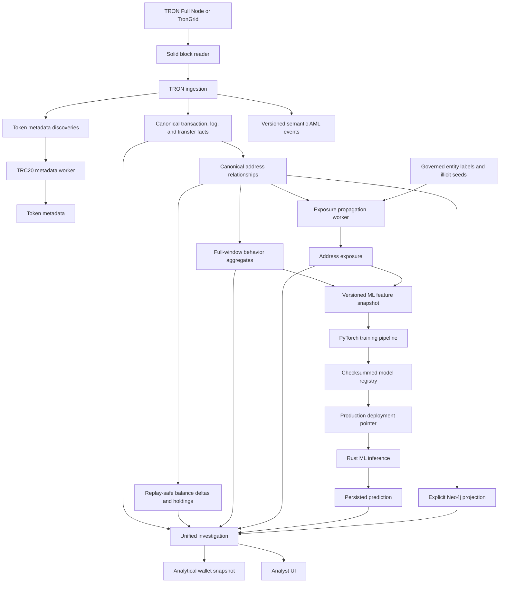

# TRON AML Platform Specification

This is the canonical specification for the TRON implementation. It describes
the code that exists now, the contracts between components, and the remaining
work required for a professional AML product. Future chain implementations must
reuse these contracts unless a chain-specific design requires a documented
exception.

The system is evidence-first:

- ClickHouse is the canonical analytical warehouse.
- Neo4j is a derived projection for traversal and visualization.
- Deterministic code parses facts and produces reproducible behavior features.
- Only a trained, deployed ML artifact may produce a laundering probability.
- A probability is an investigative estimate, not a legal conclusion.

## 1. Product Output

The unified wallet investigation must provide:

1. A fund-flow graph.
2. Indexed TRX and TRC20 holdings.
3. A behavioral fingerprint.
4. Direct and propagated exposure to governed illicit seeds.
5. An optional calibrated ML probability and confidence.
6. Evidence references and data-quality warnings.
7. A durable analytical snapshot that can be retrieved later.

The primary endpoint is:

```text
GET /api/tron/wallet/{address}/investigation
```

The durable analytical endpoint is:

```text
GET /api/analysis/tron/wallet/{address}
```

## 2. Current Architecture


```mermaid
flowchart TD
    RPC["TRON Full Node or TronGrid"] --> Solid["Solid block reader"]
    Solid --> Fetcher["TRON ingestion"]
    Fetcher --> Facts["Canonical transaction, log, and transfer facts"]
    Fetcher --> Discovery["Token metadata discoveries"]
    Fetcher --> Semantics["Versioned semantic AML events"]
    Discovery --> MetadataWorker["TRC20 metadata worker"]
    MetadataWorker --> Metadata["Token metadata"]
    Facts --> Relationships["Canonical address relationships"]
    Relationships --> Holdings["Replay-safe balance deltas and holdings"]
    Relationships --> Fingerprint["Full-window behavior aggregates"]
    Relationships --> ExposureWorker["Exposure propagation worker"]
    Labels["Governed entity labels and illicit seeds"] --> ExposureWorker
    ExposureWorker --> Exposure["Address exposure"]
    Relationships --> Projection["Explicit Neo4j projection"]
    Fingerprint --> Features["Versioned ML feature snapshot"]
    Exposure --> Features
    Features --> PyTorch["PyTorch training pipeline"]
    PyTorch --> Registry["Checksummed model registry"]
    Registry --> Deployment["Production deployment pointer"]
    Deployment --> Inference["Rust ML inference"]
    Inference --> Prediction["Persisted prediction"]
    Facts --> Investigation["Unified investigation"]
    Holdings --> Investigation
    Fingerprint --> Investigation
    Exposure --> Investigation
    Prediction --> Investigation
    Projection --> Investigation
    Investigation --> Snapshot["Analytical wallet snapshot"]
    Investigation --> UI["Analyst UI"]
```

## 3. Source Map

Runtime and schema:

- `app/src/config.rs`: runtime configuration.
- `app/src/db/init.rs`: SQL migration statement parser.
- `app/src/db/init_tron.rs`: migration ledger, cleanup guard, and schema
  validation.
- `app/sql/init_database_tron.sql`: fresh-install bootstrap.
- `app/sql/tron_migration_20260705_0005_wallet_ml_native.sql`: ML lifecycle
  tables.
- `app/sql/tron_migration_20260726_0006_analytical_node.sql`: analytical
  snapshot tables.
- `app/sql/tron_migration_20260729_0007_evidence_integrity.sql`: canonical
  evidence, replay safety, finality journal, governed labels, exposure evidence,
  ML deployment, and holdings v2.

Ingestion:

- `app/src/services/tron/fetcher.rs`: finalized block and transaction ingestion.
- `app/src/helper/tron.rs`: TRON RPC client and retry/rate-limit behavior.
- `app/src/services/tron/ingestion_state.rs`: block journal and replay checks.
- `app/src/services/tron/batcher/generic.rs`: durable in-memory batch flush.
- `app/src/services/tron/relationship_builder.rs`: transfer relationship facts.
- `app/src/services/tron/semantic_event_builder.rs`: semantic event rows.
- `app/src/services/tron/tron_metadata_worker.rs`: queued TRC20 metadata
  enrichment.

Intelligence:

- `app/src/services/tron/exchange/*`: exchange attribution and exchange flows.
- `app/src/services/tron/exposure/*`: amount-, time-, hop-, and
  service-weighted exposure propagation.
- `app/src/services/tron/wallet_exposure.rs`: wallet exposure summary.
- `app/src/services/tron/wallet_fingerprint.rs`: identity and behavior
  fingerprint.
- `app/src/services/tron/wallet_ai_risk.rs`: feature snapshot, model loading,
  inference, confidence, explanation, and persistence.
- `app/src/services/tron/analytical_node.rs`: durable wallet analysis snapshot.

Graph and API:

- `app/src/services/tron/neo4j/*`: chain-aware Neo4j projection and path output.
- `app/src/services/tron/wallet_investigation.rs`: unified response assembly.
- `app/src/router.rs`: API routes.
- `app/web/index.html`: analyst investigation UI.

Workers and tools:

- `app/src/bin/tron_init_schema.rs`
- `app/src/bin/tron_token_metadata_worker.rs`
- `app/src/bin/tron_ingest_entity_labels.rs`
- `app/src/bin/tron_propagate_exposure.rs`
- `app/src/bin/tron_export_wallet_graph.rs`
- `app/src/bin/tron_graph_api.rs`
- `ml/tron_wallet_risk/build_training_csv_from_api.py`
- `ml/tron_wallet_risk/train.py`
- `ml/tron_wallet_risk/export_training_dataset.sql`

## 4. Canonical Warehouse Contract

### 4.1 Normalized evidence

`transactions`

- One execution/fee summary keyed logically by `tx_hash`.
- Stores exact `UInt256` fee fields. Address and amount fields are a primary
  transaction summary only; graph readers do not treat them as complete
  multi-contract transfer evidence.
- Failed transactions remain visible with `status = 0`.
- Failed transactions do not generate successful transfer or holdings facts.

`address_relationships`

- The single persisted canonical value-transfer fact.
- Covers native TRX, TRC10, TRC20, contract call value, and successful
  receipt-reported internal value movements.
- Transfer IDs encode their deterministic source: contract index, event-log
  index, or internal transaction/value index.
- Amount is exact `UInt256`.
- The physical fact does not repeat constant `event_type`/`hop_count` fields or
  transaction-level protocol text. Protocol is joined from
  `transaction_features` by the canonical view when graph output needs it.
- Semantic actions such as swap or bridge are not represented as synthetic
  wallets or fake transfer edges.
- Mint/burn facts are retained for holdings, while the canonical graph view
  excludes the zero address.

`raw_logs` and `token_transfers`

- Compatibility tables for pre-0008 installations.
- Ingestion no longer writes them because the data duplicated the canonical
  transfer fact and increased warehouse size.
- Existing rows are retained until explicitly removed with destructive schema
  cleanup. A local archival node is the reprocessing source when raw receipts
  are needed.

`semantic_aml_events`

- Versioned detector output for swap, bridge, liquidity, mint, and burn
  semantics.
- Stores detector name/version, confidence, and JSON evidence.
- Semantic events are evidence features, not wallet risk verdicts.

### 4.2 Canonical read views

The following views collapse replayed inserts by event identity:

- `transactions_canonical`
- `address_relationships_canonical`
- `exchange_flows_canonical`

All graph, fingerprint, exposure, and investigation readers use the canonical
relationship view.

Fresh installations use `ReplacingMergeTree` event keys. Existing append-only
installations remain readable through canonical views until a physical
compaction/rebuild is scheduled.

### 4.3 Finality and checkpoints

`ingested_blocks` records:

- chain
- block number and hash
- parent hash
- block timestamp
- transaction count
- finality and ingestion status

Only TRON solid blocks are indexed. A block is marked `COMPLETE` only after all
of its batches have been acknowledged by ClickHouse. The sync checkpoint is then
advanced to the complete block boundary.

If a previously complete solid block appears with another hash, ingestion stops
and requires explicit reconciliation. It does not silently mix two histories.

`ingestion_failures` stores one replaceable failure record per
block/transaction/stage identity. It preserves the first failure time, latest
failure time, attempt count, error class, retryability, and `OPEN` or `RESOLVED`
status. A later successful completion resolves all open failures for that block.

Operators can replay one finalized block or an inclusive range:

```powershell
cargo run --bin tron_replay_blocks -- <start_block> [end_block]
```

The command is capped at 10,000 blocks, requires the range to be no newer than
the current solid head, and does not update `sync_state`. It reprocesses a
complete block only when the observed hash matches the journaled hash. The
legacy append-only `exchange_flows` table is replaced by deterministic
`exchange_flows_v2` identities and the canonical view, so exchange evidence is
also replay-safe.

The generic batcher keeps rows in memory until `insert.end()` succeeds. A failed
flush remains retryable.

### 4.4 Live and backfill modes

- `SYNC_MODE=backfill`: one bounded ingestion pass.
- `SYNC_MODE=live` or `auto`: continuous finalized-head polling.
- `TOTAL_TRON_TXS=0`: no transaction limit for a pass.
- A positive transaction limit stops before the next block when possible.
- The first oversized block is processed completely to preserve checkpoint
  integrity.

### 4.5 Historical performance and monitoring

`tron_benchmark_ingestion` runs a bounded, non-replay historical range. Blocks
already journaled as `COMPLETE` are skipped, preventing benchmark runs from
creating physical duplicates in append-only facts. Each run persists one row in
`ingestion_benchmarks` with:

- source kind (`local_node` or `remote_api`)
- requested and completed blocks
- transaction count and elapsed time
- block and transaction throughput
- core table rows, compressed bytes, and active parts before/after
- optional bounded unified-investigation latency
- detailed metrics JSON and failure status

Benchmark rows expire after 365 days. Canonical evidence has no TTL.

`GET /api/tron/ingestion/health` reports:

- source availability and latest solid block
- durable checkpoint and block lag
- processing, stale processing, and failed block counts
- open retryable and non-retryable failures
- exact missing block-journal ranges over a bounded window
- core ClickHouse row, compressed-byte, and active-part totals

Graph performance uses one ClickHouse relationship query per breadth-first
frontier, enforces a global edge limit, and batch-loads entity/exchange metadata.
The measured baseline is in `docs/tron_performance_baseline.md`.

## 5. Transfer and Parser Coverage

Implemented:

- Every contract in a multi-contract transaction is inspected.
- Native `TransferContract` and `TriggerSmartContract.call_value`.
- TRC10 `TransferAssetContract` and smart-contract `call_token_value`.
- TRC20 `Transfer(address,address,uint256)` logs.
- Successful receipt-reported internal TRX and TRC10 value movements.
- Exact 256-bit TRC20 amounts.
- Successful/failed receipt handling.
- Swap, bridge, liquidity, mint, and burn semantic detectors from observed
  transfers.

Not yet implemented:

- Shielded transaction semantics.
- Resource delegation, staking, governance, and account permission events.
- A complete TVM call tree beyond the internal value records exposed by the
  transaction receipt.

These are evidence coverage gaps. They must be completed before claiming full
TRON transaction coverage.

## 6. Token Metadata and Holdings

TRC20 discovery is separated from ingestion:

1. Ingestion writes `token_metadata_discoveries`.
2. `tron_token_metadata_worker` finds unresolved token contracts.
3. It calls `symbol()`, `name()`, `decimals()`, and `totalSupply()` through
   `triggerconstantcontract`.
4. Return values are ABI-decoded, including bytes32 string fallback.
5. Retry/failed state is recorded in `token_metadata_jobs`.
6. Metadata failures cannot stop transfer ingestion.

The worker never assumes six decimals after a failed contract call.

Holdings use:

- `wallet_asset_balance_deltas_v3`
- `wallet_asset_balances`

Delta identities derive from canonical transfer IDs and are replay-safe. All
asset families use the same projection. Mint and burn zero-address legs are
excluded from wallet balances.

TRC10 balances are exact in raw units. TRC10 metadata enrichment is not yet
implemented, so the API marks those assets as metadata-incomplete and the UI
shows raw quantities instead of inventing a decimal precision.

`balance_raw` is exact `UInt256`. `balance_decimal` is for display and can lose
precision for very large values. `balance_incomplete = 1` means the indexed
window began after the wallet had already acquired the asset, so outgoing
history exceeds observed incoming history. The API must show this warning rather
than claiming a complete balance.

This is an indexed-flow balance, not an authoritative present-state RPC
balance. A future reconciliation worker must periodically compare it with node
state.

## 7. Entity and Label Governance

The intelligence layer deliberately separates named ownership from structural
similarity. `entity_labels` contains address-to-entity claims;
`address_cluster_claims` contains behavioral evidence that addresses belong to
the same operational structure. A heuristic cluster cannot silently become a
named entity attribution.

`intelligence_sources` governs analyst, law-enforcement, regulatory, vendor,
public-research, internal, and heuristic feeds. Sources have trust tiers and an
active state. Each entity label includes:

- chain and address
- entity id, name, and type
- confidence
- governed source, source record id, submitter, and optional case id
- wallet/service role and optional superseded label id
- evidence references
- review status
- `created_at_unix_ms`

There are no `valid_from_unix_ms` or `valid_to_unix_ms` fields.

`tron_ingest_entity_labels` accepts JSONL. Source records and evidence are
required, and submissions are replay-safe. Only approved labels update the
current `address_entity`, `exchange_addresses`, or `exposure_seeds` projection.
A rejection retracts a projection only when that exact claim created it.
Pending reviews do not change current attribution.

`intelligence_reviews` is immutable confirmation/rejection history.
`address_cluster_memberships` is the current approved membership projection,
while `cluster_versions` preserves every membership change and member count.

`tron_discover_address_clusters` scans canonical transfer evidence for
multi-funder wallets that sweep into approved exchange service anchors and for
high fan-in/fan-out service structures. Every detector result remains pending.
`tron_review_intelligence` is the operator-only approval/rejection path.
Approved clusters are exposed in the unified investigation response and Neo4j.

Detailed source, label, review, and clustering formats are in
`docs/tron_entity_intelligence.md`.

Labels need provenance and analyst review. A model target must never be generated
from the model's own prediction or from a deleted rule score.

## 8. Exposure Engine

`tron_propagate_exposure` loads approved seeds and propagates outgoing fund-flow
exposure over canonical transfer edges.

Each propagated row records:

- source and exposed address
- minimum hop distance
- path count
- exposure score
- best path amount share
- best path time weight
- whether a service intermediary reduced attribution
- last transaction and block evidence
- direction and exposure type

The edge contribution combines:

- source seed severity
- per-asset outgoing amount share
- one hop decay per traversed edge
- 180-day time decay
- a lower service-mediated factor for exchange destinations

Multiple independent source scores are combined with:

```text
1 - product(1 - source_score)
```

This is deterministic graph evidence. It is an ML input, not the final wallet
probability.

Each seed scan has a generation in `exposure_runs`. Rows become visible only
after the generation is complete, and readers ignore rows from older
generations. This removes stale paths without asynchronous delete mutations.

Current limitations:

- Propagation follows outgoing directed flow only.
- Best-path evidence is summarized, not persisted as a full path array.
- The worker performs per-frontier ClickHouse queries and needs a bulk frontier
  strategy for very large seed sets.
- Entity/cluster-level exposure and cross-chain bridge continuation remain to be
  added.

## 9. Behavioral Fingerprint

The fingerprint contains:

- current entity/service identity
- exact full-window transfer and unique transaction counts
- exact incoming/outgoing counts and raw volumes
- exact unique sender/receiver counts
- exact token diversity
- exact swap, bridge, contract-call, and exchange interaction ratios
- timing, burst, and concentration features
- dominant assets
- top sender and receiver fingerprints
- non-verdict behavior flags

Full-window aggregates are computed in ClickHouse. Detailed events are capped for
response size. `is_truncated` means the detailed sample is incomplete, not that
the full transfer totals are capped.

`wallet_type` and behavior flags are descriptive classifications such as
collector, distributor, service hub, bridge user, or swap-heavy wallet. They are
not laundering probabilities.

## 10. ML Risk Lifecycle

### 10.1 Feature contract

Rust persists `wallet_ml_feature_snapshots` using:

```text
tron_wallet_behavior_features_v2
```

The feature vector combines:

- volume and transaction count transforms
- fan-in and fan-out
- flow imbalance
- timing/burst behavior
- swap, bridge, exchange, and contract ratios
- counterparty concentration
- token diversity
- graph exposure score, source count, path count, and hop proximity
- identity context
- sample truncation and data volume

Feature order and schema version are part of the model artifact contract.

### 10.2 Training data

One unique wallet must produce one training row. Required input:

```text
address,label,<all feature columns>
```

`label=1` means the wallet belongs to the laundering/suspicious training class
under the documented label policy. `label=0` means a reviewed benign example.

The Python builders reject:

- duplicate addresses
- missing features
- empty values
- NaN or infinite values
- datasets without both classes

The ClickHouse export selects one latest feature snapshot per wallet, preventing
the same wallet from appearing multiple times in random partitions. For mature
evaluation, split by entity/cluster and time as well; address-only random splits
can still overestimate performance when related wallets occur in different
partitions.

### 10.3 Training and calibration

`ml/tron_wallet_risk/train.py`:

- performs label-stratified train/validation/test splits
- fits normalization on training data only
- trains a PyTorch MLP with class weighting
- fits Platt calibration on validation logits
- evaluates calibrated metrics on an untouched test set
- calculates tied-rank ROC AUC correctly
- exports model, feature schema, metrics, and registration SQL

The test partition is not used to fit the neural network or calibrator.

`--activate` is gated by:

- minimum test sample count
- minimum test AUC
- maximum test Brier score

The defaults are a starting gate, not a regulatory acceptance policy.

### 10.4 Registry and deployment

`wallet_ml_training_runs` stores training provenance and train/validation/test
counts.

`wallet_ml_model_registry` stores:

- model id/version/family
- feature schema and calibration version
- metrics and label policy
- serialized artifact
- SHA-256 artifact checksum

`wallet_ml_model_deployments` is the production pointer for a feature schema.
Rust first loads the deployed model. A legacy `status = ACTIVE` registry row is
supported only for backward compatibility.

Rust verifies the artifact checksum and feature shape before inference.

### 10.5 Prediction and confidence

`wallet_ml_predictions` stores every scored snapshot with:

- calibrated risk probability and percent
- risk level
- confidence
- feature contributions
- model pattern descriptions
- evidence references
- model and calibration versions

Confidence is not the risk probability. It combines held-out model quality,
distance from the 0.5 decision boundary, wallet data volume, truncation, and
out-of-distribution standardized feature distance.

When AI is disabled or no model is deployed, the API returns an unavailable
status and no probability. It does not substitute a rule formula or zero-risk
verdict.

## 11. Neo4j Contract

Wallet identity is:

```text
(chain, address)
```

TRON wallets use `chain = 'tron'`. This prevents collisions when the platform
adds other chains.

Neo4j is updated only by explicit projection commands:

```text
POST /api/tron/wallet/{address}/neo4j/import
```

GET endpoints are read-only and build their response from ClickHouse. They do
not mutate Neo4j.

Only real transfer relationships are projected. Semantic swap/bridge/mint/burn
events are not represented as fabricated wallet nodes.

The two-wallet path API searches ClickHouse up to ten hops:

```text
GET /api/tron/wallet/{source}/paths/{target}
```

It returns paths and an optional Neo4j browser query. Search limits and
truncation are explicit in the response.

## 12. Analytical Node

The analytical node persists:

- current subject pointer
- immutable wallet analysis snapshots
- extracted evidence rows
- optional job state

The wallet snapshot includes graph, holdings, fingerprint, exposure, model
identity, risk availability, evidence, warnings, and the warehouse data cutoff.

Freshness uses the latest complete `ingested_blocks` cutoff, not the last edge in
a truncated graph. It also stores an `analysis_input_version` covering current
entity attribution, exposure generation/seed state, deployed model, and relevant
token metadata. A stored snapshot is regenerated when its chain cutoff or any
of those non-chain intelligence inputs changes.

`risk_available` distinguishes:

- a valid model probability of zero
- AI disabled
- model not trained/deployed
- inference unavailable

## 13. API Contract

Health and readiness:

```text
GET /health
GET /ready
```

`/health` is process liveness. `/ready` checks ClickHouse and Neo4j and returns
HTTP 503 when either is unavailable.

Wallet routes:

```text
GET  /api/tron/wallet/{address}/graph
GET  /api/tron/wallet/{address}/holdings
GET  /api/tron/wallet/{address}/fingerprint
GET  /api/tron/wallet/{address}/ai-risk
GET  /api/tron/wallet/{address}/investigation
GET  /api/tron/wallet/{source}/paths/{target}
GET  /api/analysis/tron/wallet/{address}
POST /api/tron/wallet/{address}/neo4j/import
```

All addresses are normalized and validated. Invalid addresses return HTTP 400.
Internal errors return HTTP 500; dependency readiness is reported separately.

## 14. Runtime Configuration

Important settings:

| Variable | Default | Meaning |
| --- | --- | --- |
| `APP_MODE` | `tron` | Active chain ingestion mode |
| `SYNC_MODE` | `auto` | `backfill`, `live`, or `auto` |
| `CLICKHOUSE_URL` | `http://localhost:8123` | ClickHouse HTTP endpoint |
| `CLICKHOUSE_USER` | `admin` | ClickHouse user |
| `CLICKHOUSE_PASSWORD` | local Compose value | ClickHouse password |
| `CLICKHOUSE_DB_TRON` | `tron_db` | TRON database |
| `TRON_RPC_URL` | `https://api.trongrid.io` | Full-node/TronGrid endpoint |
| `TRON_API_KEY` | none | Optional TronGrid key |
| `TRON_START_BLOCK` | `0` | Backfill start |
| `TOTAL_TRON_TXS` | `200` | Per-pass limit; `0` is unlimited |
| `TRON_POLL_INTERVAL_SECONDS` | `3` | Live finalized-head polling |
| `TRON_METADATA_POLL_INTERVAL_SECONDS` | `5` | Metadata queue polling |
| `TRON_METADATA_BATCH_SIZE` | `100` | Metadata jobs per pass |
| `TRON_METADATA_MAX_ATTEMPTS` | `5` | Metadata retry limit |
| `NEO4J_URI` | `localhost:7687` | Neo4j Bolt endpoint |
| `NEO4J_USERNAME` | `neo4j` | Neo4j user |
| `NEO4J_PASSWORD` | local Compose value | Neo4j password |

Process environment variables take precedence. When a variable is absent, the
application also reads `.env` from the current directory or `app/.env`, then
uses the documented development default.

Local defaults are for development only. Production deployment must inject
secrets and node endpoints through its secret manager.

## 15. Operating the TRON Stack

Start dependencies:

```powershell
cd D:\Sarbazi\dockerizd_eth_code\app
docker compose up -d clickhouse neo4j
```

Apply and validate schema:

```powershell
cargo run --bin tron_init_schema
```

Run continuous ingestion:

```powershell
cargo run --bin arz_axum_for_services
```

Run metadata enrichment in another process:

```powershell
cargo run --bin tron_token_metadata_worker
```

Import governed labels and seeds:

```powershell
cargo run --bin tron_ingest_entity_labels -- <labels.jsonl>
```

Propagate exposure:

```powershell
cargo run --bin tron_propagate_exposure
```

Run API/UI:

```powershell
cargo run --bin tron_graph_api
```

Open:

```text
http://127.0.0.1:4001/
```

Check dependencies:

```powershell
Invoke-RestMethod http://127.0.0.1:4001/ready
```

Apply/validate the schema and smoke-test ClickHouse plus Neo4j:

```powershell
cargo test --test tron_stack_smoke -- --ignored
```

## 16. Removed or Deprecated Objects

The active architecture does not use:

- `transaction_risk`
- `address_profiles`
- `address_counterparties`
- `address_token_delta`
- `address_token_balance`
- `mv_token_balance`
- `wallet_asset_balance_deltas` v1
- `wallet_asset_balance_deltas_v2`
- active writes to legacy `raw_logs` and `token_transfers`
- synthetic semantic graph edges
- formula-based wallet risk assessments

Obsolete data objects are dropped only when
`TRON_ALLOW_DESTRUCTIVE_SCHEMA_CLEANUP=true`. Active tables are never dropped
merely because a migration-added column is missing; they are migrated in place
and validated afterward.

## 17. Template for Future Chains

Every chain adapter must implement these layers in order:

1. **Finalized canonical ingestion**
   - chain-native finality policy
   - block journal and reorg handling
   - exact amounts
   - replay-safe event identity
   - minimal execution header and canonical evidence references
   - raw payload retention only when it cannot be recovered from the owned node
     or is required by a defined reprocessing policy

2. **Canonical money movement**
   - native transfers
   - fungible token transfers
   - internal transfers/traces where supported
   - mint/burn handling
   - failed/reverted execution behavior

3. **Asynchronous enrichment**
   - token metadata
   - contracts/protocols
   - entities/services
   - source provenance and retries

4. **Semantic evidence**
   - swaps
   - bridges
   - liquidity
   - exchange ingress/egress
   - chain-specific typologies

5. **Graph and exposure**
   - chain-aware `(chain, address)` identity
   - explicit Neo4j projection
   - governed seeds
   - amount/time/hop/service weighting

6. **Wallet investigation**
   - holdings with completeness state
   - full-window fingerprint
   - graph and path output
   - data quality
   - durable analytical snapshot

7. **ML lifecycle**
   - versioned features
   - governed labels
   - entity/time-aware train/validation/test splits
   - calibration and untouched evaluation
   - checksummed artifact registry
   - explicit deployment pointer and rollback
   - persisted explainable predictions

Do not copy chain-specific parser assumptions into the shared model. Normalize
each chain into the shared evidence contract.

## 18. Remaining Production Deliverables

The current code is a serious TRON foundation, but it is not yet equivalent to
Chainalysis. The highest-priority remaining work is:

1. Add authoritative balance reconciliation against a local full/solidity node.
2. Add explicit finalized-hash repair tooling after a local TRON node is the
   configured canonical authority.
3. Add TRC10 metadata enrichment and validate rare contract/value variants
   against a long-running local-node corpus.
4. Replace the small embedded exchange seed set with governed, versioned entity
   feeds and analyst review workflows.
5. Persist full exposure paths and add entity/cluster and cross-chain exposure.
6. Add cluster/entity resolution and service deposit-address attribution.
7. Add entity- and time-grouped ML evaluation, class-prevalence monitoring,
   precision/recall operating points, and drift monitoring.
8. Add model deployment history, rollback CLI, shadow evaluation, and approval
   workflow.
9. Add authenticated analyst cases, notes, dispositions, audit logs, and role
   based access.
10. Extend current ClickHouse/Neo4j smoke tests and ingestion monitoring with
    alert delivery, backups, restore tests, and disaster recovery.
11. Replace the static SVG graph with scalable graph rendering, filtering, path
    evidence, and large-graph summarization.
12. Extract chain-agnostic interfaces before adding the remaining networks.

These are tracked as explicit gaps so the product does not overstate its
coverage or confidence.
